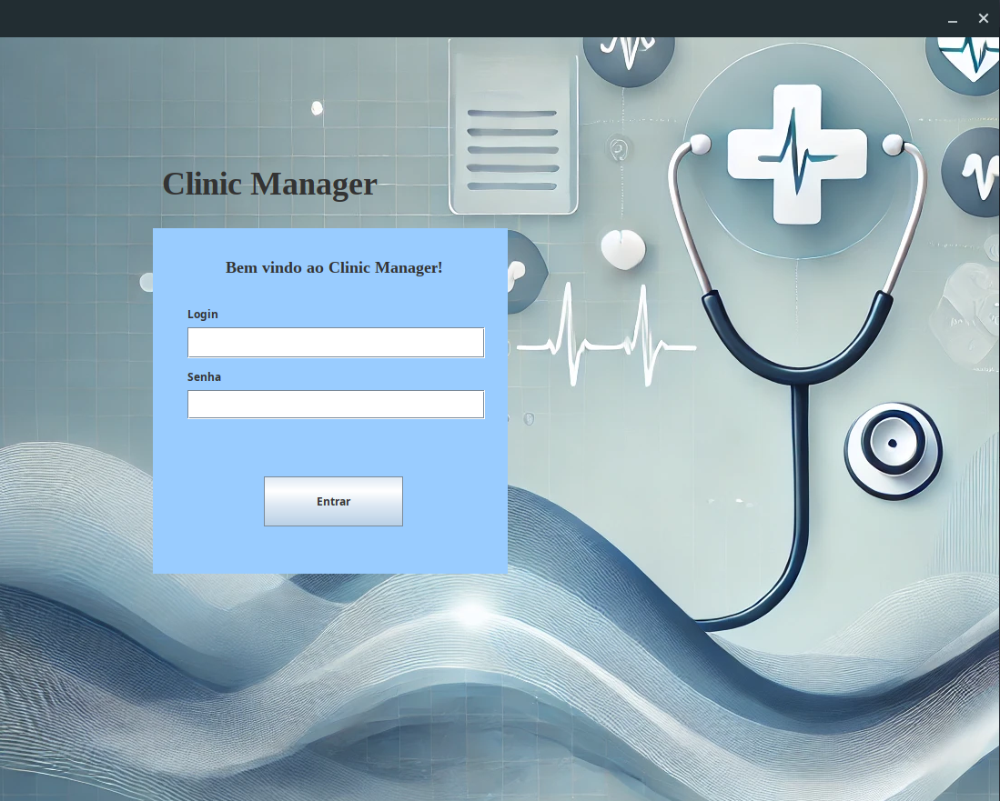

# Clinic Manager
## Dependências
Programa foi desenvolvido utilizando java 11, não testado com outras versões.

Link da JDK utilizada para desenvolvimento, apesar de necessitar apenas da JRE.

[Java-11-Download](https://docs.aws.amazon.com/corretto/latest/corretto-11-ug/downloads-list.html)

Necessário possuir o maven instalado, ou utilizar uma IDE com suporte.

Também é necessário possui o SGBD MYSQL 8 instalado, recomendo a instalação utilizando o docker.

**Banco de Dados:**
- **Docker**: [Instale aqui](https://docs.docker.com/get-docker/)  
- **Docker Compose**: [Instale aqui](https://docs.docker.com/compose/install/)
Para criar o container com o MYSQL e já criar o banco de dados da aplicação, basta entrar na pasta */infra* e executar o seguinte comando 

```shell
docker compose up -d
```


No pacote resources/schema/database.sql possui o script de criação do banco de dados do programa, assim como um arquivo resources/db.properties o qual deve ser configurado com as credencias do seu banco de dados.

## Como rodar o programa:

### Utilizando sua IDE de preferência 
Após estar com o banco de dados configurado, basta compilar o programa através de uma ide de sua preferência e executar a classe main

### Segunda forma:

**Considerando que você esteja com o terminal aberto na pasta do projeto:**

**Essa etapa considera que você tenha o make instalado em sua máquina.**

Já deixei um Makefile configurado e um *".jar"* pronto para execução basta rodar o programa com:
```bash
make rodar_programa_preparado
```
*Comando 1*

Ou se caso você queira compilar o pacote você mesmo basta rodar o seguinte comando:

```bash
make
```
*Comando 2*

E apos isso rodar o comando:
```bash
make rodar_programa_pos_compilacao
```
# Utilização do programa

No script do banco de dados foi inserido um usuário administrador o qual o login é "admin" e a senha "admin".

**Tela de Login**


**Tela Principal**


**Menu de Cadastro**<br>
:warning: Foto saiu com baixa qualidade


**Dialog de cadastro de consulta Médica**


**Dialog de cadastro de Pacientes**

